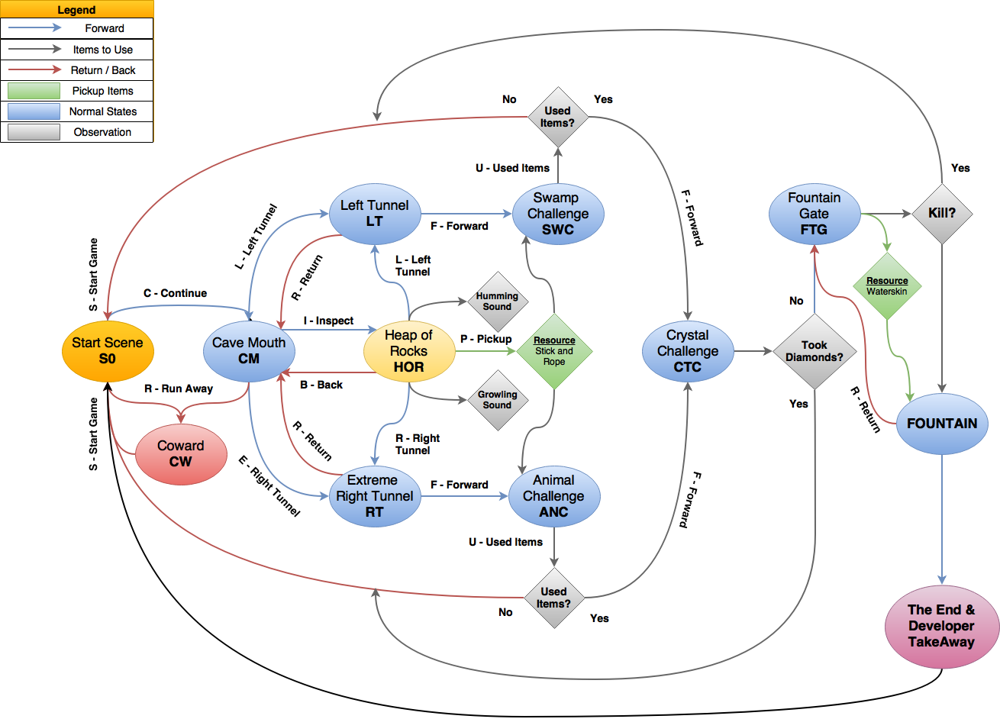

# CaveOfHope-Text-Adventure-Game
Cave of Hope is a Simple and Beginner Level Text Adventure Game made with Unity3D 2019.x and Visual Studio 2019. 

### Support this project

If you learned something new, then plese support this project on **Flattr**

 

---

## Download and Usage

Currently, the game is distributed in two formats, WebGL and Windows Binary (x86_64). Both of them can be found within the Build folder under their respective section. Compressed Archives can be found under the Releases folder. Alternatively, you can download them directly using the link below. 

**Latest Release:** https://github.com/AnimeshShaw/CaveOfHope-Text-Adventure-Game/releases/tag/v2.0

---

## Game Design Document (GDD)

---

If you can have an idea or want to suggest a feature, feel free to start an issue or contact me on [Twitter: Rumpelstil7skin](https://twitter.com/Rumpelstil7skin)

__Mail Me:__ anim3.sh[at]outlook[dot]com
